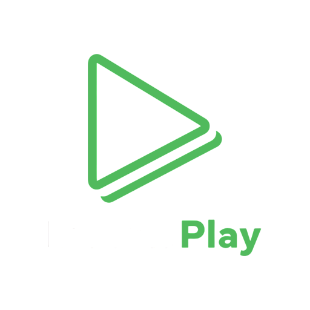
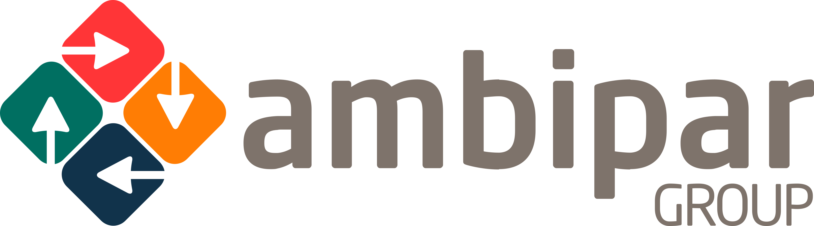
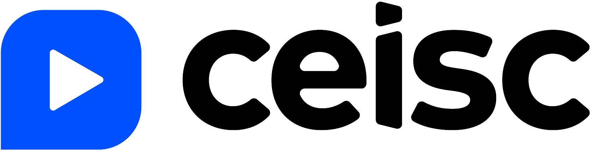
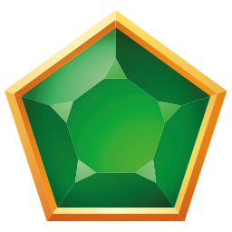

# Olá, eu sou Julio Carvalho Guimaraes 👋

## Sobre mim

Comecei minha jornada em 2019, ainda na faculdade, programando em Java 8, onde desenvolvi alguns jogos e sistemas de gestão. Ao concluir a faculdade em 2020, surgiu uma oportunidade como desenvolvedor em uma empresa de materiais infantis (para crianças de 0 a 8 anos), onde aprendi React, Next.js, NestJS e PHP, atuando por quase um ano.

Em seguida, ingressei em uma empresa que fornecia mão de obra para grandes corporações, onde trabalhei por 3 anos e aperfeiçoei minhas habilidades em React, React Native, Next.js, NestJS e Laravel. Durante esse período, prestei serviços para empresas como LibertaPlay, AgileGo, Ambipar, OMO, CEISC, entre outras.

Atualmente, estou desempregado. Meus últimos trabalhos foram como freelancer, atuando de forma mais generalista, como um verdadeiro "faz tudo", para um cliente proprietário de uma rede de cassinos virtuais e de um cassino presencial em São Paulo.

## 🚀 Tecnologias que trabalho

### Frontend
- **React** - Desenvolvimento de interfaces modernas
- **Next.js** - Aplicações React com SSR/SSG
- **React Native** - Desenvolvimento mobile
- **Swift** - Desenvolvimento mobile
- **SwiftUI** - Desenvolvimento mobile
- **TypeScript** - Desenvolvimento de interfaces modernas
- **Tailwind CSS** - Desenvolvimento de interfaces modernas
- **Material UI** - Desenvolvimento de interfaces modernas
- **Ant Design** - Desenvolvimento de interfaces modernas
- **Bootstrap** - Desenvolvimento de interfaces modernas
- **HTML** - Desenvolvimento de interfaces modernas

### Backend
- **NestJS** - Framework Node.js para APIs robustas
- **Laravel** - Framework PHP para desenvolvimento web
- **PHP** - Desenvolvimento backend
- **Node.js** - Desenvolvimento backend
- **Python** - Desenvolvimento backend
- **PostgreSQL** - Desenvolvimento backend
- **MySQL** - Desenvolvimento backend
- **MongoDB** - Desenvolvimento backend
- **Redis** - Desenvolvimento backend

### Outras
- **Java 8** - Desenvolvimento de jogos e sistemas de gestão

## 💼 Empresas que já trabalhei

### Empresas de Materiais Infantis
*Desenvolvedor - 2020-2021*
- Desenvolvimento de sistemas para produtos infantis (0-8 anos)
- Tecnologias: React, Next.js, NestJS, PHP

### Empresa de Mão de Obra Técnica
*Desenvolvedor - 2021-2024*
- Prestação de serviços para grandes corporações
- Tecnologias: React, React Native, Next.js, NestJS, Laravel

### Clientes atendidos:

  <h3>🏢 Empresas que já trabalhei</h3>
   
  
  
  
  
  
  
  
  
    
  
  <h4>🎰 Empresas como Freelancer</h4>
   
  
  
  
  
  
   
  
  <h5>Outros clientes:</h5>
  
<strong>Cassino Mirante</strong> • <strong>Rei do Cassino</strong>

### Freelancer
*Desenvolvedor Generalista - 2024 - 2025*
- Desenvolvimento para rede de cassinos virtuais
- Desenvolvimento para cassino presencial em São Paulo

### Empresa atendida como freelancer
- Cassino Monte Carlo
- Cassino Mirante
- Rei do Cassino
- Jade Bet
- Bateu Bet

## 🎯 O que estou buscando

- **Oportunidades de trabalho** como desenvolvedor
- **Projetos desafiadores** que me permitam crescer
- **Colaboração** em equipes inovadoras
- **Aprendizado** de novas tecnologias

## �� Como me encontrar

- **Email**: [xulioguimaraes@gmail.com]
- **LinkedIn**: [https://www.linkedin.com/in/xulioguimaraes/]
- **WhatsApp**: [https://wa.me/5594988110021]

## �� Estatísticas do GitHub

---

⭐ **Estou sempre aberto a novas oportunidades e desafios!**# xulioguimaraes
